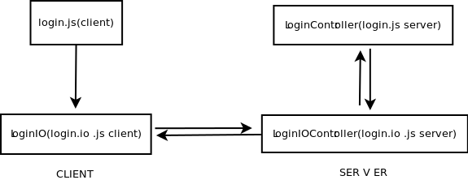

hmvc
====

A hierarchical mvc framework for node.js.
I created this framework in order to create my bachelor degree project.

dependencies
====

The framework was tested in node.js 0.10 and the requested frameworks are:
  -express
  -ejs(I will put a jade example soon if i have time).

license
====

The MIT License (MIT)

Copyright (c) 2014 Paraschiv Alexandru Nicolae

Permission is hereby granted, free of charge, to any person obtaining a copy
of this software and associated documentation files (the "Software"), to deal
in the Software without restriction, including without limitation the rights
to use, copy, modify, merge, publish, distribute, sublicense, and/or sell
copies of the Software, and to permit persons to whom the Software is
furnished to do so, subject to the following conditions:

The above copyright notice and this permission notice shall be included in all
copies or substantial portions of the Software.

THE SOFTWARE IS PROVIDED "AS IS", WITHOUT WARRANTY OF ANY KIND, EXPRESS OR
IMPLIED, INCLUDING BUT NOT LIMITED TO THE WARRANTIES OF MERCHANTABILITY,
FITNESS FOR A PARTICULAR PURPOSE AND NONINFRINGEMENT. IN NO EVENT SHALL THE
AUTHORS OR COPYRIGHT HOLDERS BE LIABLE FOR ANY CLAIM, DAMAGES OR OTHER
LIABILITY, WHETHER IN AN ACTION OF CONTRACT, TORT OR OTHERWISE, ARISING FROM,
OUT OF OR IN CONNECTION WITH THE SOFTWARE OR THE USE OR OTHER DEALINGS IN THE
SOFTWARE.

Example
====

In order to run the example you need to create a database in mysql with a table users.

        CREATE TABLE `users` (
          `username` varchar(25) NOT NULL,
          `password` varchar(100) NOT NULL,
        );
        
The primary file (app.js):

        Hmvc = require('hmvc');
        express = require('express');
        ejs = require('ejs');
        var app = express();
        
        app.configure(function () {
            app.engine('.html', require('ejs').__express);
            app.set('view engine', 'html');
        
            app.use(express.static(__dirname + '/plugins/'));
        
            app.use(express.cookieParser('bleah'));
            app.use(express.bodyParser());
            app.use(express.session());
        });
        
        hmvc = new Hmvc({app:app,renderer:ejs.render,sqlfile:"sqlStatements",langfile:'lang'});
        
        hmvc.setMysqlHost({
            host : 'localhost',
            user: 'root',
            password: 'amber',
            database: 'baza'
        });
        hmvc.loadModules(__dirname+"/modules");
        var modules = hmvc.modules;
        
        app.get('/', function(req, res){
            res.render('index', {
                stylesheets: modules.stylesheets,
                javascripts: modules.javascripts
            });
        });
        
        app.listen(7076);
  
  In order to function properly hmvc require this structure in every module:
       
        login
        |
        --css
        |
        --javascript
        |
        --mvc
           |
           --controllers
           |
           --models
           |
           --views
       
  In client to server connection I recomend use this kind of structure
        
  
  The login.js file(client):
      
      function Login(){
        $("#lbutton").on('click',function(){
          LoginIO.authenticate({username:$("#username").val(),password:$("#password").val()});
        });
      }
      
  The login.io.js file(client):
      
      LoginIO = function(){ };
      LoginIO.authenticate = function(data){
          $.post('/login',data,function(data){
             alert(data);
          });
      };
      
  The login.io.js file(server):
    
      module.exports = function LoginIoController(modules,_this){
        _this.app.get('/login',function(req,res){
            req.session.lang = 'en';
            modules.login.controller.loadPage(req.session,res);
        });
    
        _this.app.post('/login',function(req,res){
            modules.login.controller.checkUserLogin(req.session,res,req.body.username,req.body.password);
        });
      };
      
  The login.js file(server):
      
      module.exports = function LoginController(modules,_this) {
          this.loadPage = function(session,res){
              res.render('login',{session:session,lang:modules.login.view.getLang()});
          };
      
          this.checkUserLogin = function(session,res,username,password){
              modules.users.controller.getUser(checkUserLoginCallback,username,password,{session:session,res:res});
          };
      
          function checkUserLoginCallback(data,err,result){
              if (err)
                  _this.logger(err);
              if (!result[0]){
                  data.res.writeHead(200, {'Content-Type': 'text/plain'});
                  data.res.write("nu ai fost logat");
                  data.res.end();
              }else{
                  data.session.user = result[0];
                  data.session.save();
      
                  data.res.writeHead(200, {'Content-Type': 'text/plain'});
                  data.res.write("ai fost logat");
                  data.res.end();
              }
          }
      };
      
  And the view:
      
      <html>
      <head>
          <link rel="stylesheet" href="login.css"/>
          
          
          
          
      </head>
      <body>
          

                

                
Username

                
<input type="text" id="username">

                
Password

                
<input type="password" id="password">

                
<%= lang.login_remember[session.lang] %><input type="checkbox" id="setcookie">

                <input type="button" id="lbutton" class="submit" value="Login">
          

      </body>
      </html>
      
  Login module depends on users module( just to show how a repository pattern and module connection works ).
  
  
