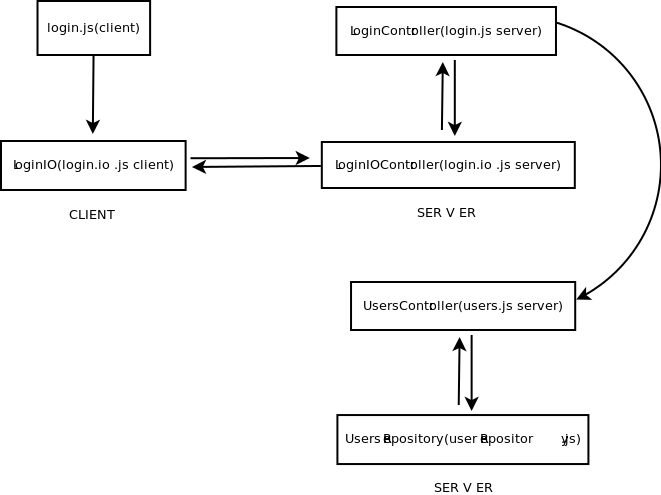

Example(AJAX)
====

In order to run the example you need to create a database in mysql with a table users.
You will also need the folowing modules:
  
    -express
    -ejs
    -connect
    -express.io( for websocket example )
    -socket.io( for websocket example )
  
```sql  
  CREATE TABLE `users` (
    `username` varchar(25) NOT NULL,
    `password` varchar(100) NOT NULL,
  );
```
        
The primary file (app.js):
```js
  Hmvc = require('hmvc');
  express = require('express');
  ejs = require('ejs');
  var app = express();
  
  app.configure(function () {
      app.engine('.html', require('ejs').__express);
      app.set('view engine', 'html');
  
      app.use(express.static(__dirname + '/plugins/'));
  
      app.use(express.cookieParser('bleah'));
      app.use(express.bodyParser());
      app.use(express.session());
  });
  
  hmvc = new Hmvc({app:app,view_extension:'html'});
  
  hmvc.setMysqlHost({
      host : 'yourhost',
      user: 'youraccount',
      password: 'yourpassword',
      database: 'yourdatabase'
  });
  hmvc.loadModules(__dirname+"/modules");
  var modules = hmvc.modules;
  
  app.listen(7076);
```  
In order to function properly hmvc require this structure in every module:
       
        login
        |
        --css
          |
          -- login.css
        |
        --javascript
          |
          -- login.js
          -- login.io.js
        |
        --mvc
           |
           --controllers
              |
              -- login.js
              -- login.io.js
           |
           --models
           |
           --views
              |
              -- login.html
       
  In client to server connection I recomend use this kind of structure
        
  
  The login.js file(client):
```js
function Login(){
    LoginIO();
}

Login.load = function(){
    $("#lbutton").on('click',function(){
        LoginIO.authenticate({username:$("#username").val(),password:$("#password").val()});
    });
};
```
  The login.io.js file(client):
```js    
LoginIO = function(){
  $.get('/login',function(data){
      $("#login_container").html(data);
      Login.load();
  });
};

LoginIO.authenticate = function(data){
    $.post('/login',data,function(data){
       alert(data);
    });
};
```    
The login.io.js file(server):
```js    
module.exports = function LoginIoController(modules,_this){
    _this.app.get('/login',function(req,res){
        req.session.lang = 'en';
        modules.login.controller.loadPage(req.session,res);
    });

    _this.app.post('/login',function(req,res){
        modules.login.controller.checkUserLogin(req.session,res,req.body.username,req.body.password);
    });
};
```    
The login.js file(server):
```js      
var ejs = require('ejs'),
    fs  = require('fs');

module.exports = function LoginController(modules,_this) {
    this.loadPage = function(session,res){
        res.render('login',{session:session,lang:modules.login.view.getLang()});
    };

    this.checkUserLogin = function(session,res,username,password){
        modules.users.controller.getUser(checkUserLoginCallback,username,password,{session:session,res:res});
    };

    function checkUserLoginCallback(data,err,result){
        if (err)
            throw err;
        if (!result[0]){
            data.res.writeHead(200, {'Content-Type': 'text/plain'});
            data.res.write("nu ai fost logat");
            data.res.end();
        }else{
            data.session.user = result[0];
            data.session.save();

            data.res.writeHead(200, {'Content-Type': 'text/plain'});
            data.res.write("ai fost logat");
            data.res.end();
        }
    }
};
```     
The view:
  ```html    
<div id="login" style="height: 160px">
    <div id='login_error' style="display: none"></div>
    <div align="center">Username</div>
    <div width="140"><input type="text" id="username"></div>
    <div align="center">Password</div>
    <div width="140"><input type="password" id="password"></div>
    <input type="button" id="lbutton" class="submit" value="Login">
</div>
  ```      
  
And the main page:
```html    
<html>
<head>
  <script language="javascript" src="jquery/jquery.js"></script>
  <script src="/socket.io/socket.io.js"></script>
  <script language="javascript">
      var socket = io.connect();
      $(document).ready(function(){
          Login();
      });
  </script>
  <% stylesheets.forEach(function(stylesheet){ %>
  <link rel="stylesheet" href="<%= stylesheet %>">
  <% }) %>

  <% javascripts.forEach(function(javascript){ %>
  <script type="text/javascript" src="<%= javascript %>"></script>
  <% }) %>
</head>
<body>
    <div id='login_container'></div>
</body>
</html>
```
  
  Login module depends on users module( just to show how a repository pattern and module connection works ).Diagram looks like this:
        
  
    users
    |
    --mvc
      |
      --controllers
        |
        -- users.js
      --repository
        |
        -- usersRepository.js
  
  The users.js file:
  ```js
  module.exports = function UsersController(modules) {
    this.getUser = function(callback,username,password,data){
        modules.users.repository.getUser(callback,username,password,data);
    };
  }
  ```      
  The userRepository.js file:
  ```js  
  module.exports = function UsersRepository(db) {
    this.getUser = function(callback,username,password,data){
        db.query("Select * from users where username=? and password=?",[username,password],callback.bind(null, data));
    };
  }
  ```
  
Example(Websockets)
====
  The hmvc module works great with the express.io module for sockets.
  Because we have a abstractization on the client we can very easily move from ajax to websocket.
  The files that will change are:
      app.js
      login.js(server)
      login.io.js(client, server)
      
  app.js
```js
Hmvc = require('hmvc');
express = require('express.io');
ejs = require('ejs');
connect = require('connect');
var app = express().http().io();


var cookieParser = express.cookieParser('your secret sauce'),
    sessionStore = new connect.middleware.session.MemoryStore();

app.configure(function () {
    app.engine('.html', require('ejs').__express);
    app.set('view engine', 'html');

    app.use(express.static(__dirname + '/plugins/'));

    app.use(express.cookieParser('bleah'));
    app.use(express.bodyParser());
    app.use(express.session({
        secret:'your secret sauce',
        store: sessionStore,
        expires : new Date(Date.now() + 3600000)
    }));
});

hmvc = new Hmvc({app:app,renderer:ejs.render,view_extension:'html'});

hmvc.setMysqlHost({
    host : 'localhost',
    user: 'root',
    password: 'amber',
    database: 'baza'
});
hmvc.loadModules(__dirname+"/modules");
var modules = hmvc.modules;

app.get('/', function(req, res){
    res.render('index', {
        stylesheets: modules.stylesheets,
        javascripts: modules.javascripts
    });
});

app.listen(7076);
```
  login.io.js(client)
```js
LoginIO = function(){
    socket.emit('login:create');
};
LoginIO.authenticate = function(data){
    socket.emit('login:auth',data);
};

socket.on('login:created',function(data){
    $("#login_container").html(data); // div in home page
    Login.load();
});

socket.on('login:authenticated',function(data){
    alert(data);
});
```
  
  login.io.js(server)
```js
module.exports = function LoginIoController(modules,_this){
  _this.app.io.route('login',{
      create: function(req){
          req.session.lang = 'en';
          modules.login.controller.loadPage(req.session,req.io);
      },
      auth: function(req){
          console.log(req.data);
          modules.login.controller.checkUserLogin(req.session,req.io,req.data.username,req.data.password);
      }
  });
};
```
  login.js(server)
```js
module.exports = function LoginController(modules,_this) {
  this.loadPage = function(session,socket){
      socket.emit('login:created',modules.login.view.render({session:session,lang:modules.login.view.getLang()}));
  };

  this.checkUserLogin = function(session,socket,username,password){
      modules.users.controller.getUser(checkUserLoginCallback,username,password,{session:session,socket:socket});
  };

  function checkUserLoginCallback(data,err,result){
      if (err)
          throw err;
      if (!result[0]){
          data.socket.emit("login:authenticated","nu ai fost logat");
      }else{
          data.session.user = result[0];
          data.session.save();
          data.socket.emit("login:authenticated","ai fost logat");
      }
  }
};
```
